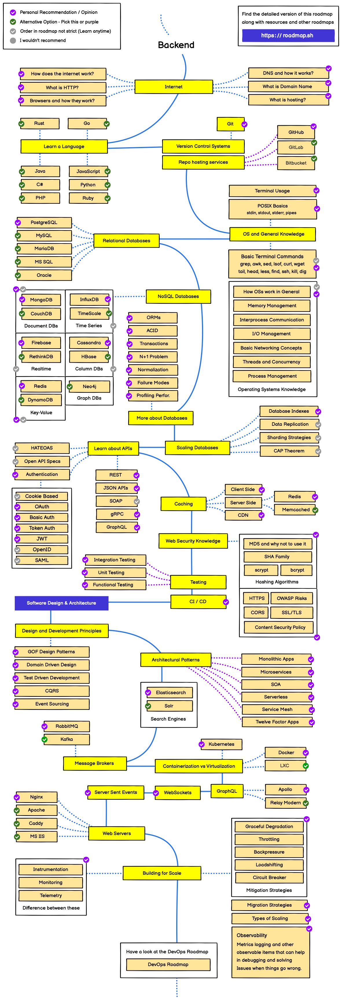

# Roadmaps-Backend-Developer
Roadmaps의 [백엔드 개발자 로드맵](https://roadmap.sh/backend)을 기반으로 한 단계별 학습 정리 저장소입니다.

---
## [Internet 인터넷](roadmap/internet/Internet.md)

- [인터넷은 어떻게 동작할까?](roadmap/internet/How_dose_the_internet_work.md)
- [HTTP?](roadmap/internet/What_is_HTTP.md)
- [브라우저는 어떻게 동작할까?](roadmap/internet/Browsers_and_how_they_work.md)
- [DNS는 무엇이며, 어떻게 동작할까?](roadmap/internet/DNS_and_how_it_works.md)
- [도메인 이름은 어떤구조일까?](roadmap/internet/What_is_Domain_Name.md)
- [웹 호스팅은 무엇일까?](roadmap/internet/What_is_hosting.md)

---
## Articles
Roadmaps의 [아티클](https://roadmap.sh/guides)을 정리한다.
1. [프록시 서버 (Proxy server)](articles/Proxy_Server.md)

---

