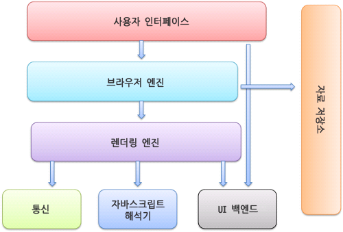

# 브라우저는 어떻게 동작할까?

### 브라우저의 기본 구성 요소
1. 사용자 인터페이스 : 주소 표시줄, 앞-뒤버튼, 북마크 메뉴
2. 브라우저 엔진 : UI와 렌더링 엔진 간의 작업을 마샬링(Marshaling)
3. 렌더링 엔진 : 요청된 콘텐츠를 표시. html일 경우 html과 css를 파싱하고 콘텐츠를 화면에 표시
4. 네트워킹 : HTTP 요청과 같은 네트워크 호출에 플랫폼 독립적인 인터페이스 뒤에 있는 여러 플랫폼에 서로 다른 구현 사용
5. UI 백엔드 : 위젯을 그리는 데 사용. 플랫폼에 구애받지 않는 일반 인터페이스를 노출. 
6. 데이터 스토리지 : 지속성 레이어. 브라우저는 쿠키와 같은 모든 종류의 데이터를 로컬에 저장함. 

### 브라우저의 렌더링 엔진
- 요청한 파일, 즉 html과 같은 문서를 우리가 볼 수 있는 형태로 렌더링 해야하는데  이는 브라우저마다 다른 렌더링 엔진을 사용한다.
- Firefox - Gecko
- Safari - Webkit
- Chrome - Blink

### ⁇
- 마샬링 : 객체의 메모리 구조에서 저장 또는 전송에 적합한 다른 데이터 형식으로 변환하는 과정