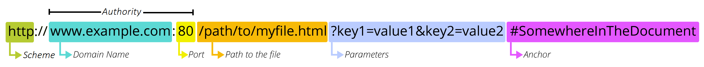

# 도메인 이름?

### 도메인 이름의 구조
    blog.example.com(.)
- . : Root
- .com : Top-level
- .example : Second-level
- blog : sub  

각각의 레밸마다 서버가 다르다.  
Root -> Top-level -> Second-level -> sub 순으로 다음 파트를 알고있다.

### URL의 구조

- Scheme : 사용자가 서버에 접속할때 어떤식으로 통신할것인지를 결정한다. http는 웹서버를 말한다.
- Domain(host) : 인터넷에서 서비스의 서버를 식별하기 위해 사용되는 이름.
- Port : 도메인으로 서버를 식별했다면 포트는 좀 더 자세하게 특정 서비스를 식별하는데 사용된다. 
하나의 서버에는 여러 서비스를 제공할 수 있기 때문에 각각의 서비스는 고유한 포드 번호로 구분된다.
  1. 웹 서비스 (HTTP) : 포트 80
  2. 보안 웹 서비스(HTTPS) : 포트 443
  3. 파일 전송 서비스(FTP) : 포트 21
  4. 이메일 서비스(SMTP) : 포트 25
- Path : 웹 서버의 디렉토리 구조를 나타내며 특정 파일이나 자원을 클라이언트에 제고할 수 있다. 리소스식별+조직화+네비게이션
- Query string : = ? + key + value / 여러개의 매개변수가 있을 경우 &로 구분한다.  
    1. 데이터 전달 : 클라이언트가 서버로 추가 데이터를 전달할 때 사용된다.
  2. 동적 콘텐츠 : 퀘리 스트링을 통해 서버는 동적으로 콘텐츠를 생서하거나 필터링 할 수 있다.
  3. 상태 유지 : 웹에서 특정 상태나 설정을 유지하는 데 사용될 수 있다.  
  
  ex) q=openai&lang=en
- key : 매개변수의 이름 - q, lang 
- value : 매개변수의 값 - openai, en

---
##### 참고 문헌
[WEB2-Domain Name System-8.도메인 이름의 구조](https://youtu.be/2EIgPYRzVwY?si=S0TDTfPDXVZgHJrD)
[Node.js - 9.URL의 이해](https://youtu.be/Zhbvui_T9VY?si=MHjIankS85s8whaB)