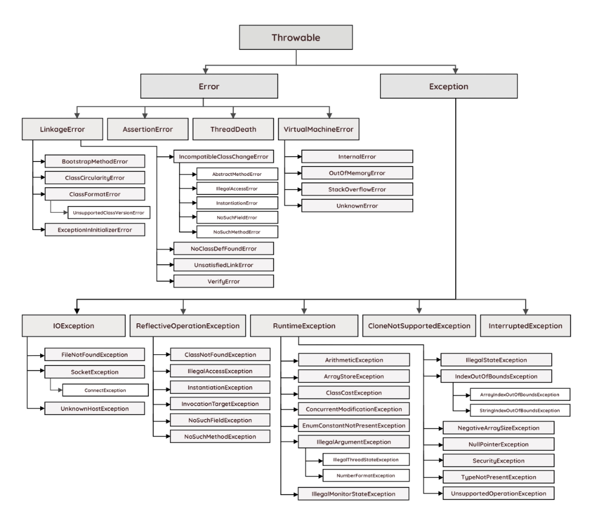

# 예외 처리

### 오류 Error와 예외 Exception
 - 오류 : 프로그램 코드에 의해서 수숩될 수 없는 심각한 오류  

ex) 메모리 부족 OutOfMemoryError, 스택오버플로우 StackOverFlowError
- 예외 : 프로그램 코드에서 수습할 수 있는 다소 미약한 오류  
- 
ex) 잘못된 전화번호 입력 시 다시 입력받음  
개발자가 구현한 로직에서 발생한 실수나 사용자의 영향에 의해 발생한다.  
예외는 에러와 달리 문제가 발생하더라도 이에 대한 대응코드를 미리 작성해 놓아 비적상적인 동작 혹은 종료를 막을 수 있다.

### 오류와 예외의 종류
  
- Exception 및 하위 클래스 : 사용자의 실수와 같은 외적인 요인에 의해서 발생하는 컴파일 시 발생하는 예외  

ex)존재하지 않는 파일의 이름 입력
- RuntimeException 클래스 : 프로그래머의 실수로 발생  

ex) 배열의 범위를 벗어남, null값 호출

### Runtime 런타임 예외 클래스 종류
| 예외 타입 |  |
| --- | --- |
| ArithmeticException | 어떤 수를 0으로 나누는 것과 같이 비정상적인 계산 중 발생 |
| NullPointerException | NULL 객체 참조시 발생 |
| IllegalArgumentException | 메서드의 전달 인자값이 잘못 되었을 경우 |
| IllegalStateException | 객체의 상태가 메소드 호출에는 부적합할 경우 |
| IndexOutOfBoundsException | index값이 범위를 벗어날 경우 |
| UnsupportedOperationException | 객체가 메서드를 지원하지 않는 경우 |
| SecurityException | 보안 위반 |
| ProviderException | 구성 공급자 오류시 발생 |
| NoSuchElementException | 구성요소가 그 이상 없는 경우 발생 |
| ArrayStoreException | 객체 배열에 잘못된 객체 유형 저장 시 |
| ClassCastException | 클래스 간의 형 변환 오류시 |
| EmptyStackException | 스택이 비어있는데 요소를 제거하려할 때 |