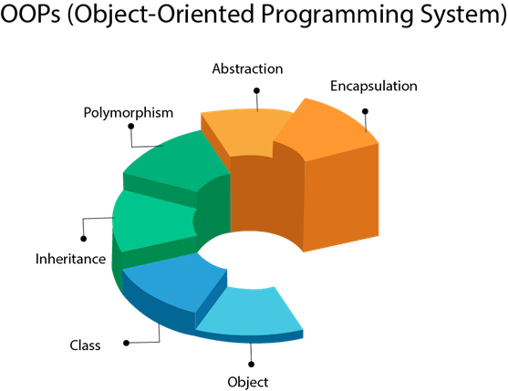

# 자바의 객체지향프로그래밍

객체지향 프로그래밍은 현실 세계의 사물과 개념을 소프트웨어로 모델링 하는 방법론이다.  
이는 프로그래머가 코드 작성 시 혀실 세계에 관찰되는 객체들의 특성과 행동을 반영하려 소프트웨어를 설계학 게발할 수 있다.  
반드시 현실 세계의 사물의 행동에 국한되어야 하는 것은 아니다. 행동을 재정의하고 나마느이 세계로 창조해 내는 것이다.

### OOP
1. 객체 Object
2. 클래스 Class
3. 상속 Inheritance
4. 다향성 Polymorphism
5. 추상화 Abstraction
6. 캡슐과 Encapsulation

---

### 객체
- 상태와 동작을 가지 ㄴ모든 엔티티를 객체라고한다.
- 객체는 클래스의 인스턴스로 정의할 수 있다.
- 객체는 주소를 포함하고 메모리에서 읿 공간을 차지한다.
- 객체는 서로의 데이터(필드)나 코드의 세부 정보(세부 행동)을 알지 못해도 메시지로 서로 협력할 수 있다.

### 클래스
- 객체의 청사진
- 객체의 상태와 행동을 정의한다.
- 클래스는 메모리 공간을 차지하지 않는다.

### 상속
- 부모 크래스의 속성과 메서드를 자식 클래스에세 상속해 사용할 수 있다.
- 부모의 행독과 상태를 자식이 사용할 수 있다.

### 다향성
- 한가지 방식이 다른 방식으로 수행되는 경우
- 메서드 오버로딩(Overloading)과 오버라이딩(Overriding)을 통해 구현된다.

### 추상화
- 내부 행동과 상태를 숨기고 기능을 하는 것
- 불필요한 세부 사항은 숨기고 중요한 부분만 노출한다.
## 객체 지향에서 추상이란?
=> 복잡한 시스템의 세부 내용을 숨기고중요한 기능이나 개념만 노출해 단순화 하는 방법이다.

### 캡슐화
- 코드와 데이터를 하나의 단위로 묶는 것
- 객체의 내부 상태를 외부에서 직접 접근하지 못하도록 하고 메서드로만 접근 가능하게 한다.